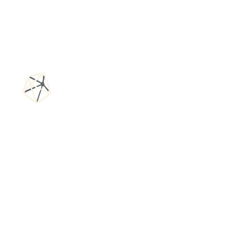

# 🚀 Tesserapt - AI-Powered DeFi Investment Platform

<div align="center">
  
  
  [](https://drive.google.com/drive/folders/1mrCr7DbDFzfmmtmVIcTFToJWRDMvoD7C)
  [](#live-demo)
  [](#documentation)
</div>

## 🎯 Overview

**Tesserapt** is a cutting-edge AI-powered DeFi investment platform that combines advanced machine learning algorithms with real-time market data to provide intelligent investment recommendations. Built on the Aptos blockchain, it offers users sophisticated tools for liquidity pool optimization, yield farming, and automated trading strategies.

### 🌟 Key Features

- **🧠 AI Investment Advisor**: LSTM-based forecasting for optimal PT/YT token splits
- **💧 Liquidity Pool Recommendations**: AI-powered analysis of the best LP opportunities
- **📊 Real-time Market Data**: Live trading pairs and market analytics
- **🔗 Aptos Integration**: Native support for Aptos blockchain and Petra wallet
- **📈 Advanced Analytics**: Comprehensive portfolio tracking and performance metrics
- **🎨 Modern UI/UX**: Sleek, responsive interface with dark mode support

## 🖼️ Screenshots

### AI Investment Advisor Modal
![AI Investment Advisor]


*Choose between LP Pool Recommendations and PT/YT Split Optimization with AI-powered insights*

### Trading Hub Dashboard
![Trading Hub]


*Discover AI-powered investment opportunities and trade on live markets with real-time data*

### Cyberpunk Cityscape
![Cyberpunk Cityscape]


Unity Metaverse game repo : https://github.com/notoriousraj/TeseraptMetaVerse

*Futuristic interface design with neon-lit aesthetics and advanced AI navigation*

## 🎥 Demo Video

Watch our comprehensive demo showcasing all features:
**[📹 Tesserapt Demo Video](https://drive.google.com/drive/folders/1mrCr7DbDFzfmmtmVIcTFToJWRDMvoD7C)**

## 🏗️ Architecture

The project consists of two main components:

### 1. Frontend Application (`staking-application/`)
- **Framework**: React 19 + TypeScript + Vite
- **UI Library**: Tailwind CSS + Radix UI components
- **Blockchain**: Aptos SDK integration
- **State Management**: React Query for server state
- **Wallet Integration**: Petra wallet adapter

### 2. AI Backend (`ai-agents/`)
- **Framework**: FastAPI + Python
- **ML Models**: LSTM neural networks for price prediction
- **Data Source**: DeFiLlama API integration
- **Deployment**: Render.com ready

## 🚀 Quick Start

### Prerequisites

- Node.js 18+ and npm/yarn
- Python 3.8+
- Git

### Frontend Setup

```bash
# Clone the repository
git clone <repository-url>
cd tesserapt/staking-application

# Install dependencies
npm install

# Start development server
npm run dev
```

### Backend Setup

```bash
# Navigate to AI agents directory
cd ../ai-agents

# Create virtual environment
python -m venv venv
source venv/bin/activate  # On Windows: venv\Scripts\activate

# Install dependencies
pip install -r requirements.txt

# Start the API server
python main.py
```

## 📁 Project Structure

```
tesserapt/
├── staking-application/          # Frontend React application
│   ├── src/
│   │   ├── components/          # Reusable UI components
│   │   │   ├── dashboard/       # Dashboard-specific components
│   │   │   └── layout/          # Layout components
│   │   ├── hooks/               # Custom React hooks
│   │   │   └── contracts/       # Blockchain interaction hooks
│   │   ├── pages/               # Application pages
│   │   ├── api/                 # API integration layer
│   │   └── lib/                 # Utilities and configurations
│   └── package.json
├── ai-agents/                   # Backend AI services
│   ├── main.py                  # FastAPI application
│   ├── lstm.py                  # LSTM model implementation
│   ├── defillama.py            # DeFiLlama API integration
│   └── requirements.txt
└── README.md
```

## 🔧 Key Technologies

### Frontend Stack
- **React 19** - Latest React with concurrent features
- **TypeScript** - Type-safe development
- **Vite** - Fast build tool and dev server
- **Tailwind CSS** - Utility-first CSS framework
- **Radix UI** - Accessible component primitives
- **React Query** - Server state management
- **Aptos SDK** - Blockchain integration

### Backend Stack
- **FastAPI** - Modern Python web framework
- **LSTM Networks** - Deep learning for price prediction
- **DeFiLlama API** - Real-time DeFi data
- **NumPy & Scikit-learn** - Data processing and ML
- **Pydantic** - Data validation
- **Uvicorn** - ASGI server

## 🎯 Core Features

### 1. AI Investment Advisor
- **LSTM Forecasting**: Advanced neural networks predict token price movements
- **Risk Assessment**: Personalized recommendations based on risk profiles
- **PT/YT Optimization**: Optimal Principal Token and Yield Token allocation

### 2. Liquidity Pool Recommendations
- **Pool Analysis**: Comprehensive analysis of LP opportunities
- **APY Optimization**: Maximize returns through intelligent pool selection
- **Risk Profiling**: Conservative, moderate, and aggressive strategies

### 3. Live Market Data
- **Real-time Prices**: Live cryptocurrency price feeds
- **Market Analytics**: Advanced charting and technical analysis
- **Trading Pairs**: Support for multiple trading pairs

### 4. Aptos Integration
- **Petra Wallet**: Native wallet integration
- **Smart Contracts**: DeFi protocol interactions
- **Transaction Management**: Seamless blockchain transactions

## 📊 API Endpoints

### AI Optimization
```http
POST /optimize
Content-Type: application/json

{
  "coin_id": "bitcoin",
  "risk_profile": "moderate",
  "maturity_months": 6
}
```

### Market Data
```http
GET /coins/{coin_id}
GET /coins/{coin_id}/history?days=30
```

### Health Check
```http
GET /health
```

## 🎨 Design System

### Color Palette
- **Primary**: `#F5F02C` (Yellow)
- **Secondary**: `#FF9450` (Orange)
- **Dark**: `#000000` (Black)
- **Light**: `#FFFFFF` (White)

### Typography
- Modern, clean fonts optimized for readability
- Consistent hierarchy across all components

## 🚀 Deployment

### Frontend (Vercel/Netlify)
```bash
npm run build
# Deploy dist/ folder to your preferred platform
```

### Backend (Render.com)
```bash
# Configure render.yaml for automatic deployment
# Set environment variables in Render dashboard
```

## 🤝 Contributing

1. Fork the repository
2. Create a feature branch (`git checkout -b feature/amazing-feature`)
3. Commit your changes (`git commit -m 'Add amazing feature'`)
4. Push to the branch (`git push origin feature/amazing-feature`)
5. Open a Pull Request

## 📄 License

This project is licensed under the MIT License - see the [LICENSE](LICENSE) file for details.

## 🙏 Acknowledgments

- **DeFiLlama** for providing comprehensive DeFi data
- **Aptos Labs** for blockchain infrastructure
- **React Team** for the amazing framework
- **FastAPI** for the robust backend framework

## 📞 Support

- **Documentation**: [Full Documentation](#)
- **Issues**: [GitHub Issues](#)
- **Discord**: [Community Discord](#)
- **Email**: support@tesserapt.com

---

<div align="center">
  <p>Built with ❤️ by the Tesserapt Team</p>
  <p>
    <a href="#top">⬆️ Back to Top</a>
  </p>
</div>
